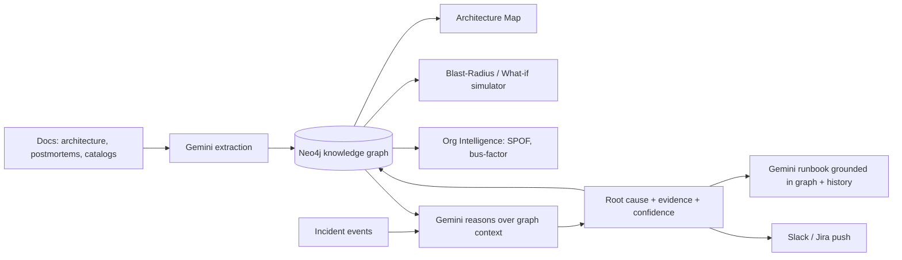
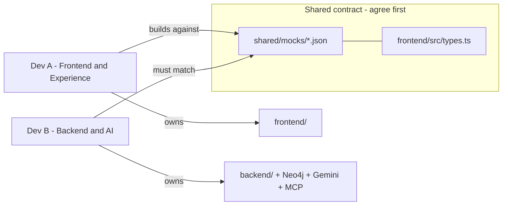

# RootSight: Strict Judge Review + Next-Phase Plan

> Goal: turn RootSight from a beautiful, mostly-curated MVP (~45% real) into a
> genuinely intelligent, demo-winning product over ~1 week: make the AI reasoning
> real, close the learning loop, sharpen the organizational-intelligence USP, and
> add one "wow" integration.

## 1. How I'd score it today (strict hackathon judge)

Overall: 6.5 / 10 as an MVP. Beautiful UI and a real ingestion pipeline, but the "AI" is mostly curated data behind a great facade.

- Problem & relevance: 8/10. Incident root-cause + org dependency mapping is a real, painful problem.
- Innovation: 6/10. Root-cause-via-dependency-graph is a crowded space; the org-intelligence angle is the fresh part (under-developed today).
- Technical execution: 6/10. `POST /api/upload` and `GET /api/graph` are genuinely real (Gemini extraction + Neo4j). But analysis, runbooks, and simulation are largely curated.
- Completeness: 5/10. Several flows are mock-only; dead code; no persistence/history; no tests.
- UX / polish: 9/10. Genuinely impressive, product-grade visuals.
- Demo readiness: 8/10. Mock fallbacks make it bulletproof on stage.

## 2. What's actually real vs. faked (verified in code)

- REAL: `POST /api/upload` -> Gemini `gemini-2.5-flash` extraction + sanitize + Neo4j MERGE (`backend/server.js` lines ~495-572). `GET /api/graph` -> live Neo4j + `deriveStatus()` health propagation (lines ~830-848).
- HALF-REAL: `POST /api/analyze` (`backend/server.js` ~873-912) returns curated `scenario.analysis`; Gemini only re-writes the `explanation` sentence. Confidence/evidence/blast-radius are hardcoded per scenario. `GET /api/org-intelligence` (~916-932) computes SPOF + ownership from the graph but overlays them on a curated template (uptime/load numbers are fabricated).
- FAKE: `POST /api/simulate` (~852-869) is a 4-scenario hardcoded library (`backend/scenarios.js`). `GET /api/runbooks` (~936-948) serves a static mock with zero generation. The landing hero graph in `frontend/src/components/Home.tsx` is fully decorative ("Auth Service" root cause, "Monitoring 48 nodes", "Analyzes 40+ APM sources" are all hardcoded).

## 3. Shortcomings & "does this already exist?"

Yes, a lot of this category exists: incident.io, Rootly, FireHydrant, PagerDuty, Datadog Watchdog, BigPanda/Moogsoft (AIOps correlation), Komodor, Causely, Cleric (AI SRE). "Correlate alerts -> guess root cause" is not novel on its own.

Honest gaps that judges will poke at:
- The "AI root cause" doesn't actually reason - it returns pre-written answers keyed by scenario name.
- Runbooks are static text, not generated for the specific incident.
- Nothing is learned or remembered between incidents ("historicalMatch" is hardcoded).
- Org metrics mix real graph computation with invented uptime numbers.
- No persistence of incidents, no auth, no tests, dead duplicate code.

## 4. Sharpened USP (what to lean into to win)

Most competitors require heavy instrumentation and only see telemetry. RootSight's defensible angle:

Anchor one-liner:
> "RootSight maps failures to your ORGANIZATION, not just your services." Built from docs you already have - no instrumentation - it exposes the single points of failure and key-person risks BEFORE they cause an outage, and turns any incident into an action grounded in who fixed it last time.

Two pillars to make unmistakable (the things judges will remember):
1. Organizational resilience intelligence - SPOFs, bus-factor / key-person risk, ownership overload, "what breaks if X dies." The human/org layer most tools ignore.
2. A diagnose -> remember -> act loop - every incident makes it smarter, and it ends in a real action (Slack message / Jira ticket), not just a dashboard.

Note: generic "AI root cause" is table stakes (crowded) - do not lead with it. Lead with the org layer and the action.

### USP improvements, ranked by "will a judge remember this"
Tied to assets you already have (Neo4j graph, Gemini, doc ingestion, and the Slack / Jira / Bitbucket MCP connectors).

| # | Improvement | Why it is a USP (most tools skip this) | Impact | Effort |
|---|---|---|---|---|
| 1 | Bus-factor / key-person risk - "if Rahul leaves, 6 critical services have no backup owner" | Tools map services, not people; emotional + novel for managers | High | Low-Med |
| 2 | Proactive resilience score - top-5 SPOFs ranked BEFORE any incident | Shifts from reactive RCA (crowded) to proactive prevention (rare) | High | Med |
| 3 | Action layer via MCP - one click: post root cause + runbook to Slack, auto-create Jira ticket | Feels like a real ops product, not a dashboard; connectors already exist | High | Low-Med |
| 4 | Deploy/code correlation (Bitbucket MCP) - "incident started 12 min after PR #441 merged to auth-service" | "It found the actual commit" is RCA gold; connector already exists | High | Med |
| 5 | Institutional memory loop - "seen before: Priya fixed INC-42 in 20 min, here is her runbook" | Captures tribal knowledge lost to turnover | Med-High | Med |
| 6 | What-if blast-radius simulator - kill any node, watch org-wide impact live | Chaos engineering without breaking anything; killer live demo | Med-High | Med |
| 7 | Natural-language to your architecture - "what breaks if Razorpay dies?" / "who owns auth?" | Makes the graph usable by PMs/managers, not just engineers | Med | Med |

### How to pitch it (so it does not sound like everyone else)
- Lead with the org layer (#1, #2): "Every incident tool tells you what broke. RootSight tells you who is overloaded, which single dependency takes you down next, and who knows how to fix it."
- Prove it with one action (#3 or #4): end the demo with a real Slack message or Jira ticket appearing - the "it actually did something" moment wins rooms.
- Frame zero-instrumentation as the wedge: competitors need agents/SDKs and weeks of setup; RootSight delivers value in 5 minutes from a Confluence export. "No agents. No SDK. Just your existing docs."

How this reshapes the build priority: #1 and #2 land in Phase 3 (org intelligence), #3 and #4 are the Phase 4 "wow" (and #4 may deserve its own slot), #5 is Phase 2, #6 is Phase 3, #7 is the stretch goal.

## 5. Phased plan (built for novice / vibe coders)

Each phase is independently demoable. Keep the mock fallbacks at every step so the demo never breaks. Work top-to-bottom.

### Phase 0 - Cleanup & safety net (half day)
- Delete the dead `src/` tree and `src/mocks/` (Vite uses `frontend/`). Confirm nothing imports from them first. (Done - already removed.)
- Add `.env.example` (NEO4J_URI, NEO4J_USERNAME, NEO4J_PASSWORD, GEMINI_API_KEY) and confirm `.env` is gitignored.
- One-line "demo mode" flag already exists via mock fallback - document it in `README.md`.

### Phase 1 - Make the AI actually reason (1.5 days) [highest impact]
- `POST /api/analyze` in `backend/server.js`: send Gemini the real event stream + a compact view of the Neo4j graph (nodes + dependency edges) and ask it to return structured JSON (rootCause, confidence, evidence[], affectedServices/teams, reasoning). Keep `scenario.analysis` and `analyzeFromGraph()` as the fallback if Gemini fails or returns junk. This converts the core feature from "lookup" to "reasoning."
- `GET /api/runbooks` -> change to generate on demand: given a root cause + the affected subgraph + any matching past incidents, have Gemini produce step-by-step remediation. Cache the last result; fall back to the static mock.

### Phase 2 - Close the learning loop (1 day) [turns it into a product]
- On each analysis, write the incident + root cause + resolver into Neo4j (`Incident` node + `CAUSED_BY` / `RESOLVED_BY` edges).
- Make `historicalMatch` real: query Neo4j for past incidents with the same root-cause node and surface "this happened before (INC-x), resolved by Y." This is a genuine differentiator - the system gets smarter with use.
- Add a simple Incident History view (new nav item in `frontend/src/App.tsx`).

### Phase 3 - Organizational Intelligence depth + What-if simulator (1.5 days) [the USP]
- Replace fabricated uptime/load in `computeOrgIntelligence()` with computed risk scores from the graph: SPOF score (fan-in of `USES_VENDOR`/`DEPENDS_ON`), bus-factor / key-person risk (engineers as sole `RESOLVED_BY` for critical services), ownership overload, longest critical dependency chain.
- Add an interactive "What breaks if X fails?" simulator: user clicks any node in the Architecture Map; backend traverses the real graph and returns the blast radius (services, teams, users). This is live, real, and visually striking - and uses the graph you already built.

### Phase 4 - Polish, demo & one "wow" integration (1 day)
- Make `frontend/src/components/Home.tsx` hero reflect real graph counts (or label it "illustrative") and fix hardcoded "48 nodes".
- Consistent loading/error/empty states (`frontend/src/components/States.tsx`) across all views.
- Seed script + 3-minute scripted demo path + the provided sample docs; refresh `README.md` with a one-command start.
- WOW (pick one, you already have the MCP connectors): push the root cause + generated runbook to Slack, or auto-create a Jira incident ticket. This makes the demo feel like a real ops tool.
- If time: a couple of backend endpoint tests so judges see rigor.

### Stretch (only if ahead of schedule)
- Natural-language graph query ("what depends on Razorpay?") via Gemini -> Cypher -> graph highlight.
- PDF/CSV ingestion of a larger real dataset to show scale.

## 6. Suggested sequencing
Phases are ordered by impact-per-effort. If the week gets tight, Phases 0 -> 1 -> 3 alone (real reasoning + real org intelligence + what-if) deliver the strongest, most defensible demo; Phases 2 and the WOW integration are the differentiators that win.

## 7. Two-person parallel execution plan (no one blocks the other)

### The big idea: the API contract is the firewall
The frontend already calls the backend first and silently falls back to local mock JSON if the backend is missing (`frontend/src/api/client.ts` + `shared/mocks/*.json`). That means:

- Dev B can build the real backend.
- Dev A can build the entire UI against the mock JSON.
- Neither waits for the other. They meet only at the "contract" (the JSON shape).

One rule that keeps you unblocked:
> Before starting any phase, the two of you spend 15 minutes agreeing on the exact JSON shape (write/adjust the mock file in `shared/mocks/` + the TypeScript type in `frontend/src/types.ts`). After that, do NOT change the shape without telling the other person. The mock file is the handshake.

### Roles (own these folders, avoid editing each other's)
- Dev B - "Backend & AI": owns `backend/` (server.js, scenarios.js, Neo4j, Gemini, MCP integrations, seed/test scripts).
- Dev A - "Frontend & Experience": owns `frontend/` (all components, views, interactions, loading/error states, demo polish).

### Per-phase split (each row = work the two can do at the same time)

Phase 0 - Cleanup (do this together first, ~30 min):
- Both: agree the folder layout is clean; confirm `.env` works; agree on Phase 1 contracts. This is the only step you sit together for.

Phase 1 - Make the AI real:
- Contract to freeze first: `AnalyzeResponse` and `RunbooksResponse` in `frontend/src/types.ts` + `shared/mocks/analyze-success.json`, `shared/mocks/runbooks-success.json`.
- Dev B: rewrite `POST /api/analyze` (Gemini reasons over events + graph) and `GET /api/runbooks` (Gemini generates per-incident steps), keeping mock fallback.
- Dev A: upgrade the Dashboard analysis panel to render the richer result (confidence, evidence list, reasoning) and the Runbooks screen to render generated steps - all against the mock JSON. Add proper loading/error states.
- Sync point: turn the backend on, set `VITE_USE_MOCKS=false`, confirm live data renders identically to the mock.

Phase 2 - Learning loop / history:
- Contract to freeze first: new `shared/mocks/incidents-success.json` + an `IncidentHistory` type.
- Dev B: persist each analysis into Neo4j; make `historicalMatch` a real query; add `GET /api/incidents`.
- Dev A: build the Incident History view + nav item in `frontend/src/App.tsx`, rendering the incidents mock.
- Sync point: run two analyses, confirm the second shows "seen before" from real data.

Phase 3 - Org intelligence + What-if (the USP):
- Contract to freeze first: keep the existing org-intelligence shape; add `shared/mocks/impact-success.json` + an `ImpactResponse` type for the what-if endpoint.
- Dev B: replace fabricated metrics in `computeOrgIntelligence()` with graph-computed risk scores; add `POST /api/impact` (given a nodeId, traverse the graph and return blast radius).
- Dev A: make Org Intelligence render real scores; make Architecture Map nodes clickable -> call `/api/impact` -> highlight the blast radius. Build against the impact mock first.
- Sync point: click a vendor node, confirm the highlighted blast radius matches the backend traversal.

Phase 4 - Polish + WOW (fully independent):
- Dev A: real data in the Home hero, fix hardcoded counts, consistent states, 3-minute scripted demo path.
- Dev B: one WOW integration via existing MCP (push root cause + runbook to Slack, or auto-create a Jira ticket), a seed script, and 2-3 backend endpoint tests.
- Sync point: dry-run the full demo end to end.

### How they stay unblocked day to day
1. Agree the contract (mock JSON + type) at the start of each phase.
2. Dev A always develops with the mock fallback on, so a missing/broken backend never blocks the UI.
3. Dev B always keeps the mock fallback in each endpoint, so a half-finished endpoint never crashes the demo.
4. Integrate at the end of each phase (the "sync point"): flip mocks off and test live together for ~30 min.
5. Git hygiene: one branch per phase per person (e.g. `p1-backend-analyze`, `p1-frontend-analyze`); since you own different folders, merges rarely conflict.
